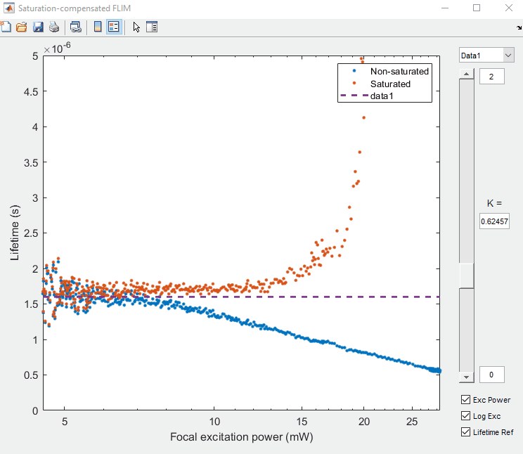

# Saturation-compensated FLIM
This is the repository of a Matlab GUI program that allows an offline calibration of the parameter K, using two groups of experimentally measured lifetime data, in the following publication:

- [Y. Zhang et al., “Saturation-compensated measurements for fluorescence lifetime imaging microscopy,” Opt. Lett., vol. 42, no. 1, p. 155, Jan. 2017.](https://www.osapublishing.org/ol/abstract.cfm?uri=ol-42-1-155)
```latex
@article{Zhang2017,
  author = {Zhang, Yide and Vigil, Genevieve D. and Cao, Lina and Khan, Aamir A. and Benirschke, David and Ahmed, Tahsin and Fay, Patrick and Howard, Scott S.},
  doi = {10.1364/OL.42.000155},
  journal = {Optics Letters},
  month = {jan},
  number = {1},
  pages = {155},
  title = {{Saturation-compensated measurements for fluorescence lifetime imaging microscopy}},
  url = {https://www.osapublishing.org/abstract.cfm?URI=ol-42-1-155},
  volume = {42},
  year = {2017}
}
```

## Installation
- Install [Matlab](https://www.mathworks.com/products/matlab.html) on your computer
- Clone this repository:
```
git clone https://github.com/yzhang34/saturation_compensated_FLIM.git
```
- Run the file 'saturation_compensated_FLIM.m' with Matlab

## Example


## License & Copyright
© 2019 Yide Zhang, University of Notre Dame

Licensed under the [Apache License 2.0](LICENSE)